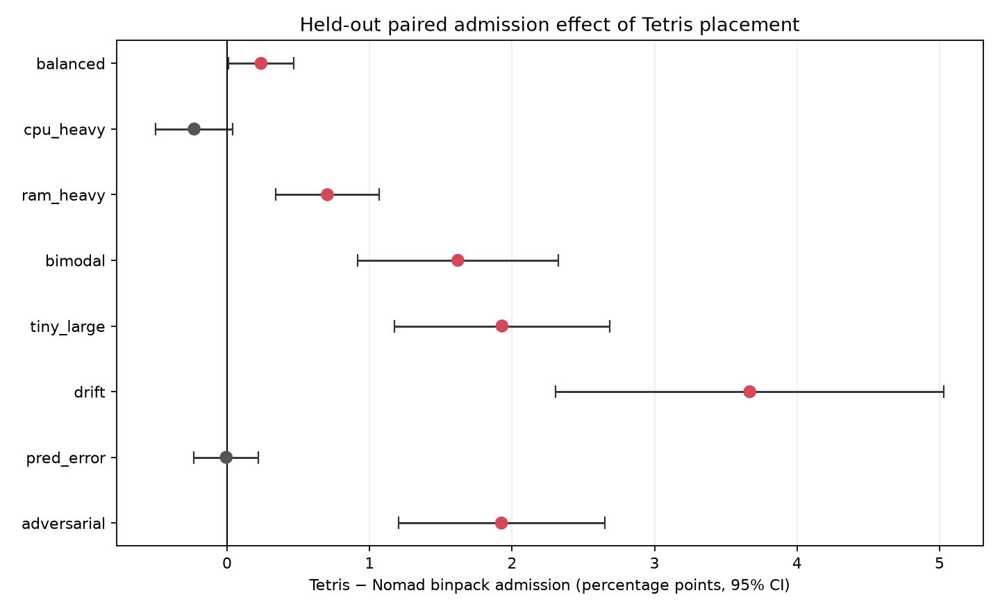
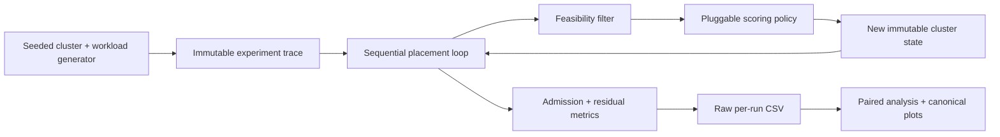
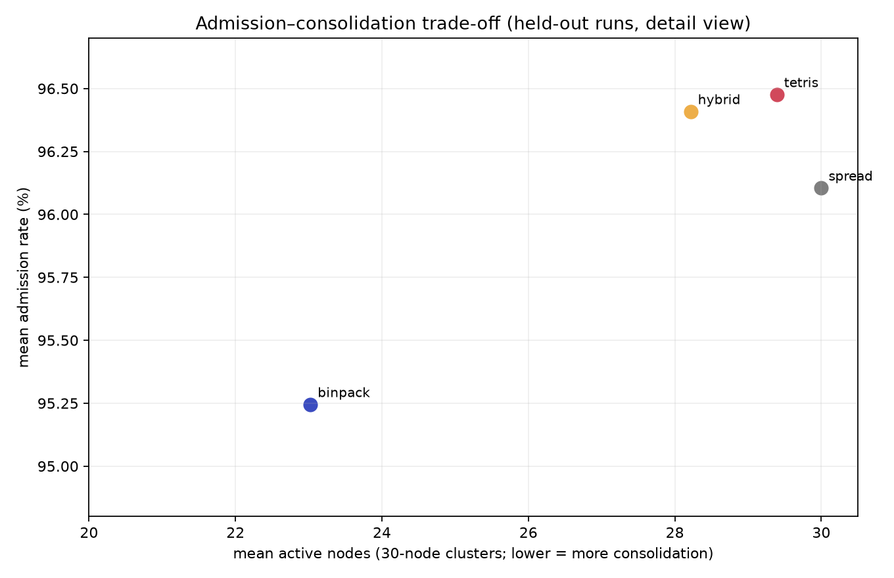

# Nomad Placement Lab

A deterministic online CPU/RAM placement simulator that reproduces
HashiCorp Nomad's fit-score heuristic and compares placement objectives under
controlled synthetic workloads.

The main result is a trade-off, not a universal winner: Tetris-style
resource-shape alignment improved held-out admission by **1.6–3.7 percentage
points** on four mixed-shape workload families, while increasing mean active
nodes from **23.0 to 29.4** on 30-node clusters. More complex EWMA/future-fit
policies added no material improvement over the stateless alignment heuristic.



## Motivation

A node can have free CPU and RAM but still be a poor match for the next
request. Greedy placement therefore balances two legitimate goals:

- **consolidation:** fill active nodes and leave whole nodes idle;
- **future schedulability:** preserve CPU/RAM shapes that can accept later
  requests.

This project asks: **How does Nomad's fixed CPU/RAM fit objective compare with
resource-shape-aware placement under balanced, skewed, mixed, drifting, and
adversarial synthetic workloads?**

## What part of Nomad is studied?

Only Nomad's CPU/RAM fit score is reproduced. The release pins the upstream
reference to HashiCorp Nomad commit
[`f3fe893c53d20681232700eb67f89f7478c2fa4e`](https://github.com/hashicorp/nomad/commit/f3fe893c53d20681232700eb67f89f7478c2fa4e).
For a hypothetical post-placement node state:

```text
free_cpu = 1 - used_cpu / total_cpu
free_ram = 1 - used_ram / total_ram
total = 10^free_cpu + 10^free_ram

binpack = clamp(20 - total, 0, 18) / 18
spread  = clamp(total - 2, 0, 18) / 18
```

The `/ 18` maps Nomad's raw score to `[0, 1]` without changing candidate
ordering. Nomad's base-10 exponential is already sensitive to CPU/RAM balance;
this project does **not** claim that the original score is
fragmentation-blind.

See [the fidelity boundary](docs/NOMAD_FIDELITY.md) for exact source links and
simplifications.

## Simulator architecture



For each request, the simulator traverses all nodes, skips infeasible nodes,
scores every feasible hypothetical placement, and retains the first candidate
encountered at the maximum score. It is **full-scan greedy placement**, not an
oracle or a globally optimal packer.

## Placement policies

| Policy | Objective |
|---|---|
| Nomad binpack | Prefer a tight post-placement fit |
| Nomad spread | Prefer more post-placement free capacity |
| Tetris | Match pre-placement free-resource shape to request shape |
| Hybrid | Weighted binpack + Tetris |
| Balance-aware | Penalize skewed post-placement CPU/RAM residuals |
| Workload mismatch | Compare residual shape with an EWMA demand profile |
| Future-fit D1/D2 | Combine binpack, Tetris, and profile-weighted residual fit |

Tetris uses capacity-normalized vectors:

```text
free   = [free_cpu / total_cpu, free_ram / total_ram]   # before placement
demand = [job_cpu / total_cpu, job_ram / total_ram]
tetris = cosine(free, demand)
```

That makes the rule easy to defend: a CPU-heavy request prefers a node with
relatively more free CPU, while a RAM-heavy request prefers a RAM-abundant
node. The formula is in `sim/experimental.py`; all policy definitions and the
EWMA update are documented in [DESIGN.md](DESIGN.md).

## Workloads and methodology

The held-out matrix covers:

- 8 workload families: balanced, CPU-heavy, RAM-heavy, bimodal, tiny/large,
  drift, corrupted prediction signal, and a constructed adversarial order;
- 2 cluster configurations: homogeneous and heterogeneous;
- 3 offered-load levels: low, medium, and high;
- 10 held-out seeds (1000–1009);
- 11 policies and ablations.

That is **48 experiment cells and 5,280 held-out policy runs**. The four primary
tuning, validation, held-out, and sensitivity artifacts contain 11,040 raw
policy-run rows when merged CSVs are counted once and their shard copies are
excluded.

Comparisons are paired: every policy receives the same cluster, request
sequence, and arrival order for a given cell and seed. Tunable policies use
seeds 0–9; validation uses 100–104; final evaluation uses 1000–1009. The runner
rejects tunable policies that are not explicitly marked as tuned on the tuning
split.

The primary metric is **admission rate** (`placed / submitted`). There are no
durations, completions, resource releases, or waiting queues, so no result is a
throughput claim. Saved wall-clock decision timings are exploratory and are
excluded from the canonical release claims.

## Results

Each row below pools 60 paired observations: 2 clusters × 3 loads × 10 held-out
seeds. Deltas are Tetris minus Nomad-style binpack.

| Workload family | Binpack admission | Tetris admission | Paired delta | 95% CI |
|---|---:|---:|---:|---:|
| balanced | 95.97% | 96.21% | +0.24 pp | [+0.01, +0.47] |
| CPU-heavy | 96.45% | 96.22% | **−0.23 pp** | [−0.50, +0.04] |
| RAM-heavy | 96.34% | 97.04% | +0.70 pp | [+0.34, +1.07] |
| bimodal | 96.21% | 97.83% | **+1.62 pp** | [+0.91, +2.32] |
| tiny/large | 96.16% | 98.09% | **+1.93 pp** | [+1.17, +2.68] |
| drift | 91.49% | 95.16% | **+3.67 pp** | [+2.31, +5.03] |
| corrupted prediction | 96.53% | 96.52% | −0.01 pp | [−0.23, +0.22] |
| adversarial order | 92.80% | 94.73% | **+1.93 pp** | [+1.20, +2.65] |

The four bold positive mixed-shape results each have 20 wins, 0 losses, and 40
ties; lower-load traces create most ties because both policies admit every
request. The CPU-heavy loss is retained: the interval includes zero, but its
direction shows that shape alignment is not uniformly beneficial.

### Admission versus consolidation



Across all 480 held-out traces per policy:

| Policy | Mean admission | Mean active nodes | Mean stranded-capacity fraction |
|---|---:|---:|---:|
| Nomad binpack | 95.25% | 23.0 | 0.230 |
| Tetris | 96.48% | 29.4 | 0.081 |
| Hybrid | 96.41% | 28.2 | 0.087 |
| Spread | 96.11% | 30.0 | 0.125 |

Binpack consolidates strongly, leaving about seven of 30 nodes idle on average.
Tetris preserves more directly usable residual capacity and admits more in
several mixed workloads, but activates nearly the whole cluster. Hybrid retains
some packing pressure and uses about one fewer active node than pure Tetris.

### Prediction was not worth the complexity

The workload profile maintains an EWMA distribution over nine request
size/shape buckets and feeds it into residual future-fit scores. On held-out
data, those variants tracked stateless Tetris but did not materially or
consistently outperform it. The workload-mismatch policy stayed effectively at
the binpack baseline. The measured conclusion is therefore negative but useful:
**the current request's shape supplied the useful signal; explicit demand
prediction did not justify its added state and tuning in this admission-only
model.**

Full statistics, ablations, and sensitivity results are in
[EXPERIMENT_REPORT.md](EXPERIMENT_REPORT.md). Citable release values are in
[`results/canonical/`](results/canonical/).

## Reproduce

Python 3.10+ is required.

```bash
python3 -m venv .venv
source .venv/bin/activate
python -m pip install -r requirements.txt

python -m pytest
python scripts/run_smoke_experiment.py
python scripts/build_canonical_results.py
```

The smoke script runs one deterministic pipeline check. The canonical builder
does not rerun or retune policies; it validates `results/matrix/final.csv` and
regenerates the release tables and plots from held-out records only.

To regenerate the held-out raw matrix with the already selected tuning
parameters:

```bash
for family in balanced cpu_heavy ram_heavy bimodal tiny_large drift pred_error adversarial; do
  python scripts/run_matrix.py final_fam "$family"
done
python scripts/run_matrix.py final_merge
python scripts/build_canonical_results.py
```

The full tuning protocol and commands are documented in
[EXPERIMENT_REPORT.md](EXPERIMENT_REPORT.md).

## Tests

The release suite has **127 passing tests**. High-risk invariants include:

- exact Nomad score boundaries and tunable-base equivalence;
- feasibility before scoring and no over-capacity placement;
- immutable node/job state and policy-run isolation;
- deterministic seeded clusters, workloads, traces, and arrival order;
- first-encountered tie behavior independent of node ID;
- CPU/RAM shape behavior and metric reconciliation;
- fresh stateful policy instances and disjoint seed splits;
- paired comparison calculations.

## Limitations

- CPU and RAM only; no devices, network, disk, storage, or topology.
- Synthetic workload families and synthetic homogeneous/heterogeneous fleets.
- Sequential placement with no arrival-time model, duration, completion,
  resource release, retry queue, or preemption.
- Full scan of feasible nodes rather than Nomad's bounded candidate evaluation.
- Reserved node resources are modeled as zero.
- Simplified feasibility and none of Nomad's affinity, anti-affinity,
  constraints, rescheduling, or concurrent evaluation behavior.
- CPU and RAM units are normalized for node-side comparisons but are not
  physically commensurable.
- Greedy results do not establish global packing optimality or production
  Nomad impact.
- Tetris gains depend on workload shape and come with a consolidation cost.
- The prediction null result applies only to these workloads and this
  admission-only model.

## Repository structure

```text
sim/                         models, policies, scheduler, workloads, metrics
scripts/run_matrix.py        tune/validation/held-out experiment driver
scripts/analyze_matrix.py    full study analysis
scripts/build_canonical_results.py
                             release validation, summaries, and plots
tests/                       deterministic unit and integration tests
results/matrix/              raw per-run records and full-study analysis
results/canonical/           small citable release evidence set
docs/NOMAD_FIDELITY.md       exact upstream connection and boundary
docs/RESUME_EVIDENCE.md      verified metrics and approved resume bullets
docs/INTERVIEW_GUIDE.md      beginner-to-advanced project defense
```

## Interview takeaway

The defensible lesson is not “I fixed Nomad.” It is: **a simple stateless
resource-shape match improved admission in several controlled mixed workloads,
but weakened consolidation; a more sophisticated predictor did not earn its
complexity.** That is a measured scheduling trade-off with explicit negative
results and limits.
# nomad-placement-evaluation
