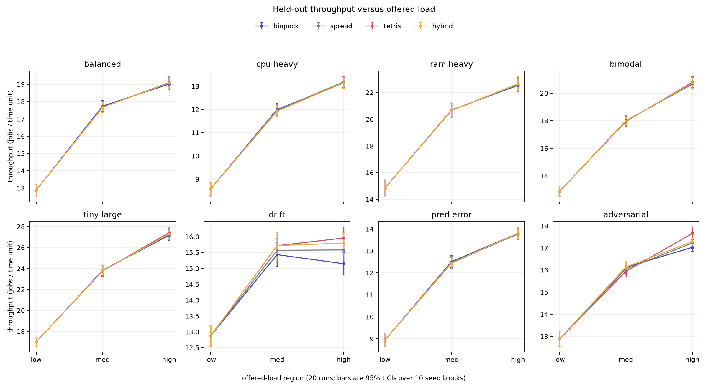
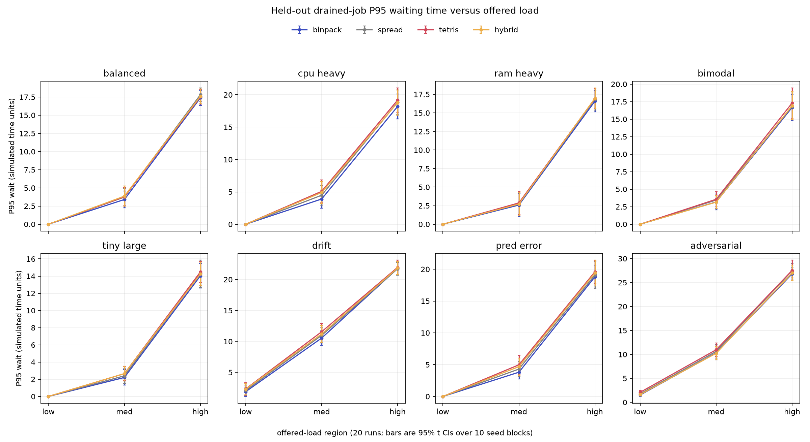
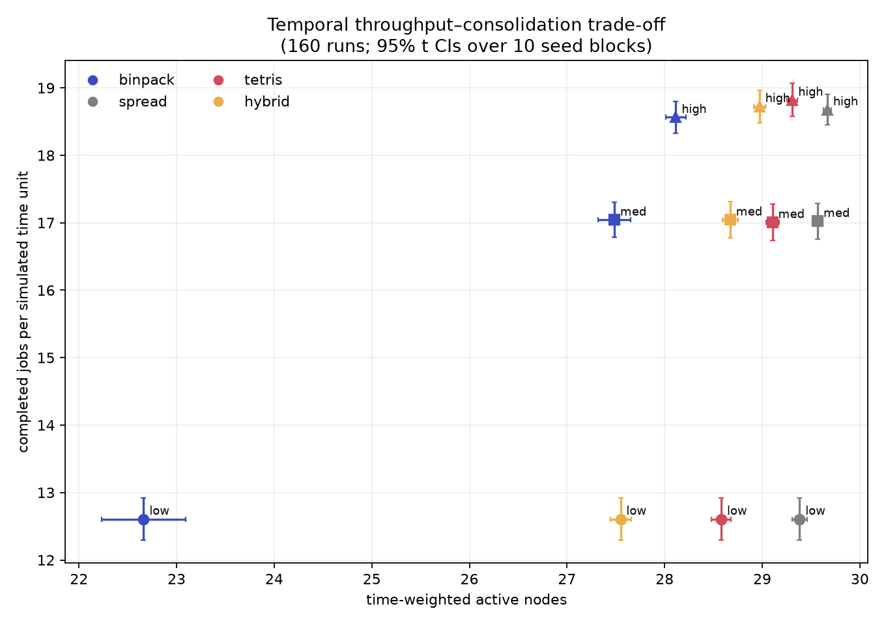

# Phase 4 temporal experiment report

## Executive result

The Phase 3 admission advantage translated into higher completed-job
throughput only under overload and only for some workload shapes. Across 160
paired held-out traces at `rho=1.30`, Tetris completed **0.256 jobs per
simulated time unit more than Nomad-style binpack** (95% paired CI
over ten seed blocks `[+0.201, +0.312]`), a **1.38%** increase over binpack's
18.563. It also used
**1.19 more time-weighted active nodes** and increased drained-job P95 waiting
by **0.53 time units**.

At underload, all policies had identical throughput. Near saturation, Tetris
was slightly worse overall: `-0.036` jobs/time unit (95% CI
`[-0.053, -0.019]`) and `+0.69` P95 wait. The result is therefore a
load-dependent throughput–consolidation–fairness trade-off, not a universal
Tetris win.



## Frozen design

The temporal layer is additive; the existing sequential admission simulator is
unchanged. Every request has a deterministic arrival and positive duration.
At a shared timestamp, the runner releases completions first, registers stable
arrivals second, and performs a FIFO-order queue scan with backfilling third.
There is no preemption or migration. A fully infeasible request is removed
instead of waiting forever.

Arrivals are Poisson, durations are independent `Uniform[8, 12]`, and the
observation horizon is 50 simulated time units. Arrival rate is derived from
resource-time demand with

```text
rho = max(lambda * E[cpu * duration] / CPU_capacity,
          lambda * E[ram * duration] / RAM_capacity)
```

Tuning seeds 0–9 calibrated and froze `rho=0.70`, `1.00`, and `1.30` before
held-out execution. On those calibration traces, binpack's mean horizon
backlog was 0.0, 39.3, and 281.1 jobs respectively, supporting the intended
underload, saturation, and overload labels. Test seeds 1000–1009 were not used
to alter durations, arrival rates, metrics, policies, or weights.

The four primary policies were Nomad-style binpack, Nomad-style spread,
Tetris, and the already selected Phase 3 hybrid
`0.1*binpack + 0.9*Tetris`. Each policy replayed the same immutable cluster,
job demands, arrivals, durations, and order for a trace.

See [the temporal design](docs/TEMPORAL_DESIGN.md) for lifecycle semantics,
metric formulas, percentile method, drain handling, and invariants.

## Matrix and statistics

The held-out primary matrix contains:

- 8 workload families;
- 2 cluster configurations;
- 3 offered-load regions;
- 10 held-out seeds per cell;
- 4 pre-frozen policies;
- **1,920 raw policy runs** (`8*2*3*10*4`).

Cell summaries contain 10 runs. Family/load summaries contain 20 runs (two
clusters × ten seeds). Overall load summaries contain 160 runs (eight families
× two clusters × ten seeds). Policy deltas are paired within each trace. For
aggregate intervals, paired deltas are macro-averaged over the predeclared
workload/cluster strata within each seed, followed by a two-sided 95%
Student-t interval over ten seed blocks (`df=9`). This avoids treating repeated
measurements with the same seed as independent. P95 rows macro-average each
run's nearest-rank drained-job P95; they do not pool individual jobs across
runs. A confidence interval crossing zero is treated as no clear difference.

## Results by offered load

Means below pool 160 held-out runs per policy/load point.

| Load | Policy | Throughput | P95 wait | Horizon backlog | Time-weighted active nodes |
|---|---|---:|---:|---:|---:|
| low | binpack | 12.607 | 0.427 | 0.01 | 22.66 |
| low | spread | 12.607 | 0.483 | 0.00 | 29.38 |
| low | Tetris | 12.607 | 0.554 | 0.02 | 28.58 |
| low | hybrid | 12.607 | 0.490 | 0.02 | 27.55 |
| medium | binpack | 17.042 | 4.992 | 41.93 | 27.49 |
| medium | spread | 17.022 | 5.342 | 42.99 | 29.57 |
| medium | Tetris | 17.006 | 5.683 | 44.12 | 29.10 |
| medium | hybrid | 17.043 | 5.428 | 41.85 | 28.67 |
| high | binpack | 18.563 | 18.789 | 282.59 | 28.12 |
| high | spread | 18.678 | 19.117 | 277.69 | 29.67 |
| high | Tetris | 18.819 | 19.318 | 273.19 | 29.31 |
| high | hybrid | 18.725 | 19.104 | 275.98 | 28.97 |

Low-load queues are nearly empty at the horizon, and all policies produce the
same completion count on each paired trace. Requests still running at the
horizon are not counted as completed. Medium has a meaningful boundary backlog
and is best described as near saturation. High is overloaded: its large
horizon backlog and time-weighted queue show accumulation over the finite
window. This experiment does not prove asymptotic queue stability, but the
low/high contrast is clear.

### Paired differences versus binpack

| Load | Policy | Throughput delta (95% CI) | P95-wait delta (95% CI) | Backlog delta | Active-node delta |
|---|---|---:|---:|---:|---:|
| low | Tetris | 0.000 `[0.000, 0.000]` | +0.127 `[+0.089, +0.164]` | +0.01 | +5.92 |
| medium | Tetris | -0.036 `[-0.053, -0.019]` | +0.690 `[+0.501, +0.880]` | +2.19 | +1.62 |
| high | Tetris | +0.256 `[+0.201, +0.312]` | +0.529 `[+0.304, +0.754]` | -9.41 | +1.19 |
| high | spread | +0.115 `[+0.072, +0.157]` | +0.328 `[+0.191, +0.465]` | -4.91 | +1.55 |
| high | hybrid | +0.162 `[+0.127, +0.196]` | +0.315 `[+0.072, +0.557]` | -6.61 | +0.86 |

At high load, Tetris obtains the largest overall throughput gain and the
lowest backlog, but not the lowest tail wait. A lower horizon backlog and a
higher all-job drained P95 wait are not contradictory: throughput favors work
completed within the observation window, while drained P95 includes long
waits among jobs that were still backlogged at the boundary.

The high-load hybrid is a measurable compromise. Relative to Tetris it gives
up 0.095 jobs/time unit, but uses 0.34 fewer time-weighted active nodes and has
0.21 time units lower P95 wait. It still outperforms binpack on high-load
throughput. Near saturation, hybrid throughput is indistinguishable from
binpack (`+0.001`, 95% CI `[-0.019, +0.021]`) while using 1.19 more active
nodes, so the compromise is not uniformly worthwhile.



## Where the result changes

Low-load throughput was identical for every family. The table gives paired
Tetris-minus-binpack throughput at medium and high loads, pooled over both
clusters (20 paired traces per cell and ten seed blocks). These family-level
intervals are exploratory and unadjusted for multiple comparisons.

| Family | Medium delta (95% CI) | High delta (95% CI) |
|---|---:|---:|
| balanced | -0.073 `[-0.105, -0.041]` | +0.090 `[-0.026, +0.206]` |
| CPU-heavy | -0.075 `[-0.103, -0.047]` | +0.022 `[-0.074, +0.118]` |
| RAM-heavy | -0.046 `[-0.083, -0.009]` | +0.114 `[+0.049, +0.179]` |
| bimodal | -0.054 `[-0.080, -0.028]` | +0.128 `[+0.051, +0.205]` |
| tiny/large | -0.068 `[-0.099, -0.037]` | +0.261 `[+0.114, +0.408]` |
| drift | +0.282 `[+0.187, +0.377]` | +0.810 `[+0.549, +1.071]` |
| corrupted prediction signal | -0.071 `[-0.115, -0.027]` | -0.004 `[-0.046, +0.038]` |
| adversarial order | -0.182 `[-0.225, -0.139]` | +0.630 `[+0.333, +0.927]` |

The clear high-load Tetris gains occur on RAM-heavy, bimodal, tiny/large,
drift, and adversarial families. Balanced, CPU-heavy, and corrupted-signal
intervals cross zero. Drift is the exception at medium load, where both
Tetris and hybrid clearly beat binpack. These outcomes support the mechanism:
resource-shape alignment is most useful when complementary or changing shapes
create placement choices, especially under pressure.

## Answers to the Phase 4 questions

1. **Did admission become throughput?** Sometimes. It did under overload on
   five shaped/mixed families, not at low load, and it was generally negative
   near saturation except for drift.
2. **Did Tetris lower queue waiting?** No overall. Its drained-job P95 wait was
   higher at every pooled load, even when its high-load backlog was lower.
3. **Where did the result change?** Load and workload order/shape both matter;
   the table above gives the paired cells.
4. **What was the consolidation cost?** Tetris used +5.92, +1.62, and +1.19
   time-weighted active nodes at low, medium, and high load respectively.
5. **Was hybrid a better compromise?** At high load, yes in a limited sense:
   less throughput than Tetris but fewer active nodes and lower P95 wait. At
   medium load it offered no clear throughput gain over binpack.
6. **Was each load stable?** Low had near-zero horizon backlog; medium was
   boundary/backlogged; high accumulated a large queue. Finite-horizon results
   do not prove asymptotic stability.
7. **Does the EWMA null result remain?** Phase 3's admission-only null result
   remains valid historical evidence. EWMA/future-fit was deliberately not
   added to the primary temporal matrix, so no temporal EWMA claim is made.



## Reproduction

From the repository root with Python 3.12 and the audited lock installed
(`python -m pip install -r requirements-lock.txt`):

```bash
python -m pytest
python scripts/run_temporal_smoke.py
python scripts/run_temporal_matrix.py calibrate

for family in balanced cpu_heavy ram_heavy bimodal tiny_large drift pred_error adversarial; do
  python scripts/run_temporal_matrix.py family "$family"
done

python scripts/run_temporal_matrix.py merge
python scripts/analyze_temporal.py
```

`results/temporal/raw/final.csv` is the authoritative 1,920-row held-out
artifact. `scripts/analyze_temporal.py` refuses malformed or incomplete input
and generates the canonical tables and four plots without rerunning or tuning
the simulation.

## Limitations and threats to validity

- Synthetic Poisson arrivals, bounded durations, and only 50 time units of
  observation; no production trace replay.
- CPU/RAM only; no network, disk, devices, topology, constraints, priorities,
  failures, autoscaling, real execution, preemption, or migration.
- Full-scan greedy placement, not Nomad's bounded candidate evaluation or a
  global scheduling optimum.
- One primary queue discipline. Backfilling can trade aggregate completion for
  older-job tail latency; strict FIFO sensitivity was not run.
- Confidence intervals quantify variation over the selected seeded synthetic
  traces, not every possible workload or production deployment.
- Family-level intervals are exploratory and unadjusted for multiple
  comparisons; they should not be read as a confirmatory family-wide error
  guarantee.
- The model reproduces a pinned CPU/RAM scoring formula, not production Nomad
  behavior or impact.
